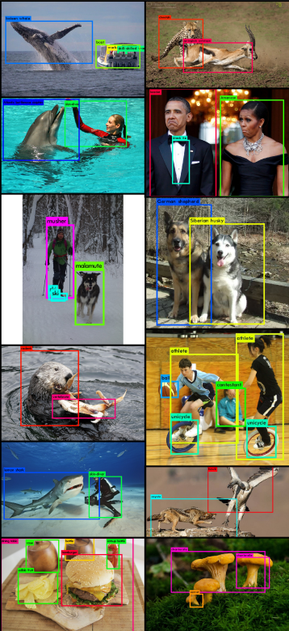
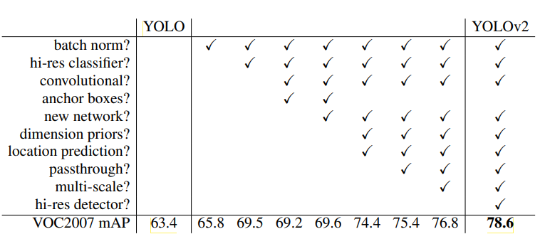
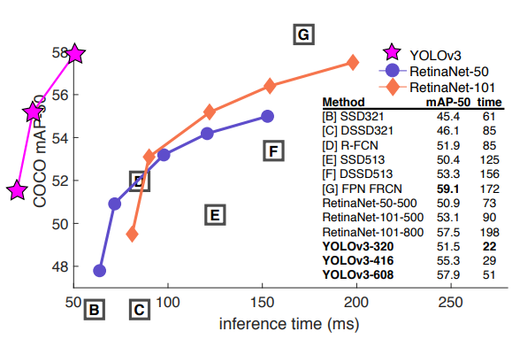
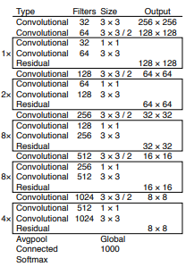

# YOLO (You Only Look Once) Object Detection Models

## Table of Contents

- [Introduction](#What-is-YOLO?)
- [YOLO Series](#yolo-series)
    - [YOLO](#yolo)
    - [YOLOv2 and YOLO9000](#YOLOv2-and-YOLO9000)
    - [YOLOv3](#yolov3)
- [YOLOv2 VS YOLOv3](#what-are-the-main-differences-between-yolov2-and-yolov3)
- [Why YOLO](#why-yolo)
- [Limitations of YOLO](#limitations-of-yolo)
- [conclusion](#conclusion)
- [Getting ready](#getting-ready)
- [References](#references)

# What is YOLO?
YOLO (You Only Look Once) is a state-of-the-art, real-time object detection system that utilizes a deep neural network to detect and identify objects in an image or video stream.
in another words, YOLO detects objects in images by dividing the input image into bounding boxes and predicts bounding boxes and class probabilities for each grid cell to classify the objects based on their probability of likeness to a pre learned class and YOLO is known for its speed and accuracy, making it widely used in computer vision applications.


# YOLO Series
## YOLO

 The first version of YOLO, developed by Joseph Redmon and Ali Farhadi, achieved real-time object detection with an average-precision (AP) of 84.6% on the PASCAL VOC dataset, introduced a single neural network to predict bounding boxes and class probabilities directly from the entire image. It divides the image into a grid and predicts bounding boxes, class probabilities, and confidence scores for each grid cell.

### YOLO Features:

- Real-time object detection
- Single forward pass for prediction
- Predicts bounding boxes and class probabilities simultaneously


For more details on YOLO, refer to the original paper:

- [You Only Look Once: Unified, Real-Time Object Detection](./Documents/yolo%20v1.pdf)

## YOLOv2 and YOLO9000

YOLOv2, also known as YOLO9000 a more advanced version of YOLO, introduced several improvements such as a better architecture, anchor boxes,the ability to detect a large number of object categories,a batch normalization, which enhanced the system's ability to generalize across various object categories. The AP on the VOC dataset improved to 91.2%, on the other hand, YOLO9000 is an extension of YOLOv2 that addresses the limitation of detecting only a predefined set of object categories. YOLO9000 introduces a hierarchical approach to classifying a wide range of object categories this approach enabled YOLO9000 detect over 9000 object categories.


### YOLOv2 and YOLO9000 Features:
- Improved architecture
- Introduction of anchor boxes
- Capability to detect a large number of object categories
- Hierarchical classification for a large number of object categories
- Improved object detection capabilities




For more details on YOLO9000 and YOLOv2, refer to the paper:

- [YOLO9000: Better, Faster, Stronger](./Documents/yolo%20v2.pdf)

## YOLOv3

YOLOv3 is is a minor improvment on YOLO9000(YOLOv2), and it brings further improvements in accuracy and speed. It introduces a darknet-53 architecture and utilizes three different scales of detection to improve performance.

### YOLOv3 Features:

- Darknet-53 architecture
- Three scales of detection for improved accuracy
- Enhanced performance




For more details on YOLOv3, refer to the paper:

- [YOLOv3: An Incremental Improvement](https://arxiv.org/abs/1804.02767)


# *YOLOv2 VS YOLOv3 ?*
YOLOv2 and YOLOv3 are two successive iterations of the YOLO object detection system, each bringing several improvements over its predecessor. Some of the main differences between YOLOv2 and YOLOv3 include:

* __Backbone:__ 

    YOLOv3 employs a darknet-53 architecture as its backbone, which provides better feature extraction capabilities. On the other hand, YOLOv2 utilizes the GoogLeNet backbone.

* __Anchor Boxes:__ 

    YOLOv3 uses a higher number of anchor boxes compared to YOLOv2, which results in a higher accuracy.

* __Batch Normalization:__ 

    YOLOv3 includes batch normalization in its architecture, which improves the model's ability to generalize across various object categories. YOLOv2 does not include batch normalization.

* __Training Methods:__

    YOLOv3 incorporates multi-scale predictions during training, enhancing the model's performance. YOLOv2, on the other hand, uses a single scale during training.

* __Average Precision:__ 

    The average precision of YOLOv3 on the PASCAL VOC dataset is 95.6%, indicating a higher detection accuracy compared to YOLOv2, which achieves an average precision of 91.2%.

In total, These improvements contribute to YOLOv3's overall superiority in terms of accuracy and performance.

# Why YOLO?

YOLO Series are a powerful and efficient object detection algorithm that offer significant advantages over traditional object detection methods. these advantages are:

* __Performance:__

    YOLO models have consistently shown strong performance in real-time object detection.

* __Fast and Real-time:__

    YOLO models are capable of performing object detection in real-time, even on resource-limited systems.

* __High Detection Rate:__ 

    YOLO models are effective at detecting multiple objects within an image, even when they overlap.

* __Cross-Platform Compatibility:__ 

    YOLO models can be implemented on various platforms, including smartphones, drones, and even autonomous vehicles.

## limitations of YOLO
however, every algorithm and method is not complete, and have their own downsides as well that need to be mentioned such as:

* __Complexity:__ 

    YOLO models can be quite complex and resource-intensive, making them challenging to implement in real-time applications or on embedded systems.

* __Accuracy Trade-off:__ 

    YOLO's focus on speed and simplicity may result in lower accuracy compared to more accurate but slower object detection algorithms.

* __Handling of Multiple:__ 

    YOLO can struggle with detecting multiple objects within the same bounding box, leading to less accurate results.

* __Weak Background Detection:__ 

    YOLO is not designed for detecting objects in varying backgrounds. Its ability to generalize well to unseen backgrounds is limited.

* __Anchor Boxes Tuning:__ 

    Adjusting the anchor boxes to the dataset can be challenging, affecting the model's accuracy.

* __False Positives:__ 

    YOLO can generate false positives, i.e., identifying objects that are not present in the input image. This can potentially lead to incorrect interpretations of the data.

## Conclusion
Overall, YOLO offers a powerful and real-time object detection approach, but its limitations should be considered based on the specific requirements of a given project and it is one of the most popular and influential object detection algorithms in computer vision. It has inspired many subsequent works and variations.


## Getting ready
to get ready for code implementation we need firstly to take some steps:
1. install the [Environment](./ENVIRONMENT.yml) file
    First, Conda  have to be installed on system. check this by running the following command in terminal:
    ```bash
    conda --version
    ```
    If Conda is not installed, download it from the official Conda website. Once Conda is installed, create a new environment by running the following command:
    ```bash
    conda create -n ENVIRONMENT.yml
    ```
    To activate the newly created environment, run the following command:
    ```bash
    conda activate ENVIRONMENT.yml
    ```

    Now that the environment is activated, it is ready to continue

2. Downloading Datasets
    we need to download and install data sets to train and test our trained module on it, for that we need to download the following:
    +
    +
    +
3. Cloning or implementing codes from this repository
    to continue  there are two ways cloning this repository or implementing the codes, to clone this repository write the following command into terminal
    ```bash
    git clone github.com/git@github.com:Mehdialmoo/Bash_commands.git
    ```
    now everything is ready to Start the journey!
    (Do not forget to visit [RubberDuck](RubberDuck.md) for help!)

## References

1. **YOLO: Unified, Real-Time Object Detection**
   - Paper: [You Only Look Once: Unified, Real-Time Object Detection](./Documents/yolo%20v1.pdf)

2. **YOLO9000: Better, Faster, Stronger (YOLOv2)**
   - Paper: [YOLO9000: Better, Faster, Stronger](./Documents/yolo%20v2.pdf)

3. **YOLOv3: An Incremental Improvement**
   - Paper: [YOLOv3: An Incremental Improvement](./Documents/yolo%20v3.pdf)

Please note that the code snippets and mathematical details can be found in the respective papers.official YOLO repository on GitHub and Webpages,for the implementation:

- [YOLO GitHub Repository](https://github.com/AlexeyAB/darknet)
- [YOLO Project Webpage](https://pjreddie.com/darknet/yolo/)
- [V7 labs Webpage](https://www.v7labs.com/blog/yolo-object-detection)